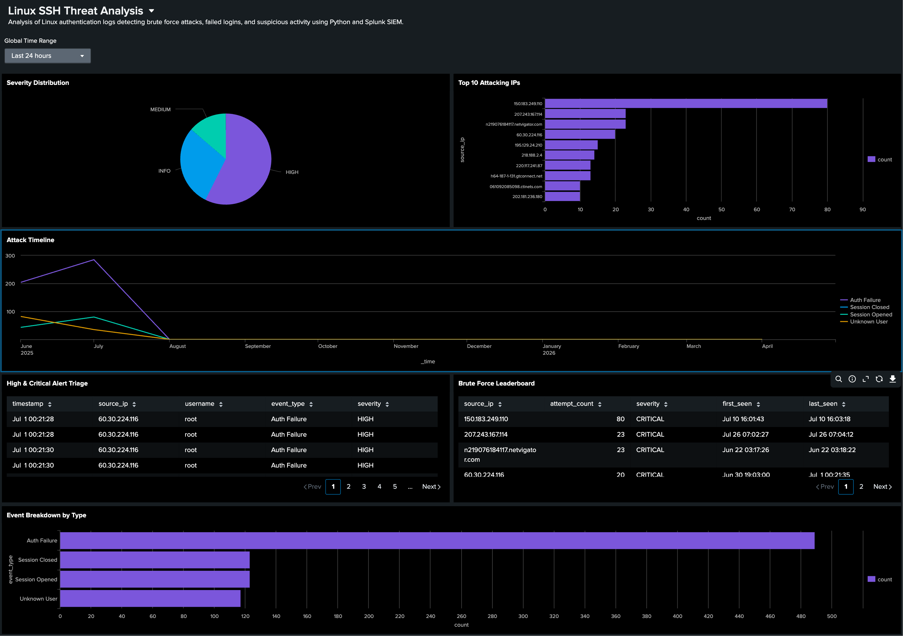

# Linux SSH Threat Analysis

A end-to-end security project that automates Linux log parsing, detects brute force attacks, and visualizes threat data in a Splunk SIEM dashboard.



---

## Overview

This project simulates a real SOC analyst workflow: ingest raw Linux syslog data, run a custom Python script to detect threats, and surface findings in a SIEM dashboard for triage and investigation.

**Dataset:** `Linux_2k.log` - 2,000 lines of real Linux authentication logs (June-July 2005)

**Tools:** Python 3, Splunk Enterprise, CSV

---

## Tools and Technologies

| Tool | Purpose |
|---|---|
| Python 3 | Log parsing, pattern detection, threat scoring, CSV export |
| Splunk Enterprise | SIEM ingestion, SPL queries, dashboard visualization |
| Regex (`re`) | Structured field extraction from raw syslog |
| CSV | Structured output for SIEM ingestion |

---

## Project Structure

```
linux-log-analysis/
├── Linux_2k.log               # Raw syslog dataset
├── log_analysis.py            # Python threat detection script
├── suspicious_logs.csv        # All parsed suspicious events
├── brute_force_alerts.csv     # IPs flagged for brute force
├── user_enumeration.csv       # Targeted usernames
└── screenshots/
    └── Linux_SSH_Threat_Analysis.png
```

---

## How It Works

### 1. Log Parsing

The script reads each line of the syslog file and uses regex patterns to extract structured fields:

- Timestamp, hostname, service, PID
- Source IP, username, event type, severity

Eight event types are detected:

| Event Type | Severity |
|---|---|
| Auth Failure | HIGH |
| Failed Login | HIGH |
| Unknown User | MEDIUM |
| Invalid User | MEDIUM |
| FTP Connection | MEDIUM |
| Session Opened/Closed | INFO |
| Logrotate Alert | LOW |

### 2. Threat Detection

**Brute Force Detection** flags any IP that exceeds a configurable failure threshold (default: 5 attempts). IPs with 20 or more failures are escalated to CRITICAL severity.

**User Enumeration Detection** identifies usernames that were repeatedly targeted in unknown or invalid user attempts, which is a sign of account enumeration activity.

### 3. Output

Three structured CSVs are exported for SIEM ingestion:

- `suspicious_logs.csv` - all parsed events with full field extraction
- `brute_force_alerts.csv` - flagged IPs with attempt counts and timestamps
- `user_enumeration.csv` - targeted usernames and attempt counts

### 4. Splunk SIEM Dashboard

The CSVs are ingested into Splunk and visualized across six dashboard panels:

- Severity Distribution (Pie Chart)
- Top 10 Attacking IPs (Bar Chart)
- Attack Timeline by Event Type (Line Chart)
- High and Critical Alert Triage (Table)
- Brute Force Leaderboard (Table)
- Event Breakdown by Type (Bar Chart)

---

## Key Findings

| Finding | Detail |
|---|---|
| Total suspicious events parsed | 852 |
| IPs flagged for brute force | 40 |
| CRITICAL severity IPs | 4 |
| Top attacker | `150.183.249.110` - 80 attempts in under 2 minutes |
| Auth failures | 489 HIGH severity events |
| Unknown user attempts | 117 MEDIUM severity events |

**Top brute force attackers:**

| IP | Attempts | Severity | Window |
|---|---|---|---|
| 150.183.249.110 | 80 | CRITICAL | Jul 10 16:01 - 16:03 |
| 207.243.167.114 | 23 | CRITICAL | Jul 26 07:02 - 07:04 |
| n219076184117.netvigator.com | 23 | CRITICAL | Jun 22 03:17 - 03:18 |
| 60.30.224.116 | 20 | CRITICAL | Jun 30 - Jul 1 |

---

## Usage

```bash
# Basic usage
python log_analysis.py

# Custom log file and threshold
python log_analysis.py --log /path/to/file.log --threshold 10

# Skip CSV export
python log_analysis.py --no-export
```

**Requirements:** Python 3.7+ (no external dependencies)

---

## Splunk SPL Queries

```spl
# Top attacking IPs
source="suspicious_logs.csv" | stats count by source_ip | sort -count | head 10

# Severity distribution
source="suspicious_logs.csv" | stats count by severity | sort -count

# Attack timeline
source="suspicious_logs.csv" | timechart count by event_type

# Brute force leaderboard
source="brute_force_alerts.csv" | table source_ip attempt_count severity first_seen last_seen | sort -attempt_count

# High/Critical triage
source="suspicious_logs.csv" severity="HIGH" OR severity="CRITICAL" | table timestamp source_ip username event_type severity | sort timestamp
```

---

## Author

**Rohan Chowdhury**

[GitHub](https://github.com/chowdhuryrz) | [LinkedIn](https://linkedin.com/in/rohan-chowdhury)
